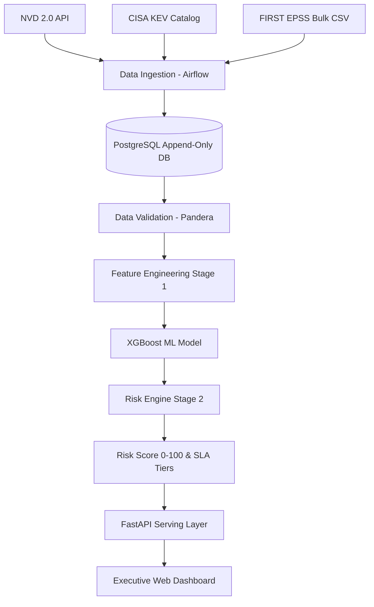
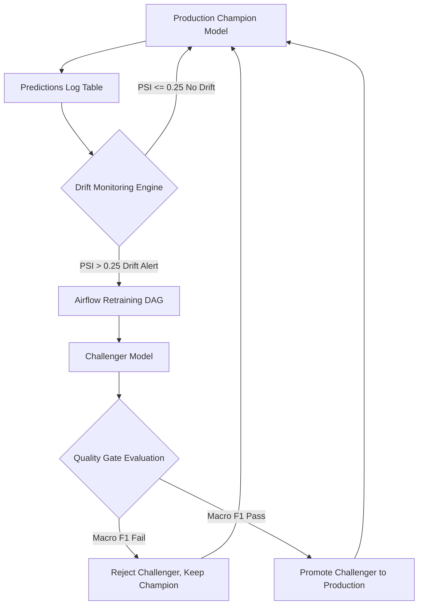

# 🛡️ Adaptive MLOps for Software Vulnerability Severity Classification & Risk Prioritization

[](https://www.python.org/)
[](https://mlflow.org/)
[](https://fastapi.tiangolo.com/)
[](https://airflow.apache.org/)
[](https://www.postgresql.org/)
[](https://www.docker.com/)
[](LICENSE)

An enterprise-grade, end-to-end **Adaptive MLOps Platform** designed to ingest known software vulnerabilities (CVEs) and threat intelligence feeds, predict CVSS base severity with probability-calibrated machine learning models, calculate composite risk scores (0–100) mapped to remediation SLAs, serve real-time predictions, monitor statistical drift, and automate model retraining.

> **Scope Note:** This platform is **not** a vulnerability *detector* (it does not perform SAST/DAST code scanning). It ingests already published CVE records to automate **Severity Classification** and **Risk Prioritization** for Enterprise Security Operations Center (SOC) teams.

---

## 💡 Real-World Problem Solved

Modern enterprise security teams face thousands of newly published Common Vulnerabilities and Exposures (CVEs) every month. Security analysts cannot patch every vulnerability immediately. Raw CVSS base scores alone do not reflect real-world threat context (e.g. whether an exploit is actively being used in the wild or whether the affected asset is internet-facing).

This platform combines **leakage-free machine learning severity prediction** with real-time threat intelligence (FIRST EPSS exploit probabilities, CISA Known Exploited Vulnerabilities) and asset metadata (asset criticality, network exposure) into a single actionable **Composite Risk Score (0–100)** mapping to remediation SLA timeframes.

---

## 🏗️ System Architecture & Data Flow



### Automated Retraining & MLOps Loop



---

## 🔬 End-to-End Machine Learning Lifecycle

```
┌─────────────────────────────────────────────────────────────────────────────┐
│                           1. INGESTION & DB                                 │
│ Pull NVD metadata, First EPSS bulk CSVs, CISA KEV catalog diffs.            │
│ Append into append-only tables (epss_history, kev_history).                 │
└──────────────────────────────────────┬──────────────────────────────────────┘
                                       │
                                       ▼
┌─────────────────────────────────────────────────────────────────────────────┐
│                     2. LEAKAGE-FREE FEATURE MATRIX                          │
│ Parse CVSS v3.1 vector string into 22 binary metric flags + CWE + keywords. │
│ Exclude post-publication EPSS/KEV to eliminate target/temporal leakage.      │
└──────────────────────────────────────┬──────────────────────────────────────┘
                                       │
                                       ▼
┌─────────────────────────────────────────────────────────────────────────────┐
│                     3. TRAINING & EXPERIMENTATION                           │
│ Temporal split by published_date. Balance classes using SMOTE.               │
│ Fit XGBoost multi-class classifier; calibrate with Isotonic Regression.     │
│ Track params, metrics (Macro F1, ECE), and artifacts in MLflow.             │
└──────────────────────────────────────┬──────────────────────────────────────┘
                                       │
                                       ▼
┌─────────────────────────────────────────────────────────────────────────────┐
│                     4. QUALITY GATE & PROMOTION                             │
│ Compare Challenger vs. Champion on holdout set. Promote if Macro F1 margin  │
│ >= 0.01. Update MLflow Model Registry stage to 'Production'.                │
└──────────────────────────────────────┬──────────────────────────────────────┘
                                       │
                                       ▼
┌─────────────────────────────────────────────────────────────────────────────┐
│                     5. COMPOSITE RISK SCORING (STAGE 2)                     │
│ Score = (0.30*ML + 0.25*EPSS + 0.25*KEV + 0.15*Asset + 0.05*Exposure) * 100 │
│ Map score (0-100) to SLA Tiers: CRITICAL (24-72h), HIGH (7d), MEDIUM (30d).  │
└──────────────────────────────────────┬──────────────────────────────────────┘
                                       │
                                       ▼
┌─────────────────────────────────────────────────────────────────────────────┐
│                     6. SERVING & DRIFT MONITORING                           │
│ FastAPI exposes endpoints; SHAP Explainer generates waterfall vectors.      │
│ Statistical Drift Monitor calculates PSI & KS-tests; triggers retrain DAG.  │
└─────────────────────────────────────────────────────────────────────────────┘
```

### 1. Ingestion & Historical Database Architecture
- **NVD API 2.0 Connector:** Fetches CVE metadata, CVSS vector strings, CWE categories, and description text.
- **FIRST EPSS Client:** Decompresses gzipped daily bulk CSV snapshots from FIRST.org and appends records to `epss_history`.
- **CISA KEV Connector:** Fetches confirmed-exploited vulnerability catalog diffs and appends to `kev_history`.
- **Append-Only Database Strategy:** `epss_history` and `kev_history` are strictly append-only (never updated in place), ensuring zero historical data overwrites and preventing temporal data leakage during training.

### 2. Leakage-Free Feature Engineering
To ensure model predictions simulate real-world availability at CVE publication time, features are divided into strict allow/deny lists:
- **Allowed Features (Stage 1 Matrix):**
  - Structured CVSS v3.1 Submetrics (parsed from CVSS vector string, NOT base score): Attack Vector, Attack Complexity, Privileges Required, User Interaction, Scope, Confidentiality Impact, Integrity Impact, Availability Impact (22 one-hot binary flags).
  - CWE parent category encodings.
  - NLP regex keyword flags extracted from CVE descriptions (e.g., `remote`, `arbitrary_code_execution`, `buffer_overflow`, `sql_injection`).
  - Affected vendor/product counts.
- **Forbidden Features (Denied from Stage 1 to Prevent Target Leakage):**
  - `epss_score` and `epss_percentile` (Stage 2 Risk Scorer only).
  - `kev_flag` and `kev_added_date` (Stage 2 Risk Scorer only).
  - `cvss_score` and `cvss_severity` (target label itself).

### 3. Model Training, Calibration & Explainability (XAI)
- **Temporal Train/Test Split:** Splits data chronologically by `published_date` to prevent future data leakage into training sets.
- **SMOTE Class Balancing:** Applies Synthetic Minority Over-sampling Technique to balance minority severity classes (NONE, LOW).
- **Calibrated XGBoost Classifier:** Fits an XGBoost multi-class softprob model and applies Isotonic Regression calibration to ensure output probabilities represent true empirical confidence.
- **SHAP TreeExplainer:** Decomposes individual predictions into feature contribution waterfall vectors for full operational transparency.
- **MLflow Experiment Tracking:** Automatically logs parameters, dataset date windows, git commit hashes, Macro F1, Critical Recall, and Expected Calibration Error (ECE) for every run.

### 4. Quality Gate, Model Promotion & Rollback
- **Champion vs. Challenger Gate:** Evaluates newly trained challenger models against active production champions on identical holdout data.
- **Promotion Threshold:** Promotes challenger to Production stage in MLflow only if its primary metric (Macro F1) beats the champion by at least a defined margin ($\ge 0.01$).
- **Rollback Mechanism:** Allows instant automated or manual rollback to previously archived champion versions if production performance degrades.

---

## 🧮 Stage 2 Composite Risk Prioritization Formula

The platform combines Stage 1 calibrated ML predictions with dynamic threat intelligence and enterprise asset context into a single normalized score between $0.0$ and $100.0$:

$$\text{RiskScore} = 100 \times \left[ 0.30 \cdot S_{\text{ML}} + 0.25 \cdot S_{\text{EPSS}} + 0.25 \cdot S_{\text{KEV}} + 0.15 \cdot S_{\text{Asset}} + 0.05 \cdot S_{\text{Exposure}} \right]$$

### Component Definitions
- $S_{\text{ML}}$: Calibrated Stage 1 ML Severity prediction confidence ($0.0 \text{ to } 1.0$)
- $S_{\text{EPSS}}$: Current FIRST EPSS exploit probability ($0.0 \text{ to } 1.0$)
- $S_{\text{KEV}}$: CISA KEV active exploitation flag ($1.0$ if listed, $0.0$ if not)
- $S_{\text{Asset}}$: Asset criticality rating ($1 \text{ to } 5$ normalized to $0.2 \text{ to } 1.0$)
- $S_{\text{Exposure}}$: Network exposure status ($1.0$ if internet-facing, $0.0$ if internal/air-gapped)

### Standard Worked Example & Unit Test
For $S_{\text{ML}} = 0.72$, $S_{\text{EPSS}} = 0.55$, $S_{\text{KEV}} = 1.0$, $S_{\text{Asset}} = 0.8$, $S_{\text{Exposure}} = 1.0$:

$$\text{Score} = (0.30 \cdot 0.72 + 0.25 \cdot 0.55 + 0.25 \cdot 1.0 + 0.15 \cdot 0.8 + 0.05 \cdot 1.0) \times 100 = 77.35 \implies \mathbf{HIGH\_RISK}$$

### Actionable Remediation SLA Tiers
- **CRITICAL_RISK (80.0 – 100.0):** Immediate patch deployment within **24–72 hours**
- **HIGH_RISK (60.0 – 79.9):** High priority remediation within **7 days**
- **MEDIUM_RISK (30.0 – 59.9):** Scheduled patch cycle within **30 days**
- **LOW_RISK (0.0 – 29.9):** Routine maintenance / best effort

---

## 📈 Adaptive MLOps: Statistical Drift Monitoring

To adapt to shifts in vulnerability disclosures and threat activity:
- **PSI & KS-Test Engine:** `StatisticalDriftDetector` continuously computes Population Stability Index (PSI) and Kolmogorov-Smirnov (KS-test) p-values comparing incoming inference features against training baseline distributions.
- **Drift Alerting Thresholds:** When PSI exceeds $0.25$ on key metric features, a drift alert is logged to the `drift_reports` database table.
- **Airflow Retraining Trigger:** Drift alerts trigger the Airflow `model_training_dag` to retrain a challenger model on updated historical data, submit it to the Quality Gate, and promote it if metrics improve.

---

## 📁 Repository Directory Structure

```
MlopsCP-main/
├── .github/workflows/
│   └── ci_cd.yml                     # GitHub Actions CI/CD pipeline
├── airflow/
│   └── dags/
│       ├── data_ingestion_dag.py     # Daily NVD, EPSS & KEV ingestion DAG
│       ├── model_training_dag.py     # Retraining, quality gate & promotion DAG
│       └── drift_monitoring_dag.py   # Statistical drift evaluation DAG
├── configs/
│   ├── config.yaml                   # Global platform thresholds & DB settings
│   ├── model_config.yaml             # XGBoost hyperparameters & quality gates
│   ├── drift_config.yaml             # PSI and KS-test drift thresholds
│   └── risk_config.yaml              # Risk scoring component weights
├── docker/
│   ├── airflow/Dockerfile            # Dockerfile for Airflow service
│   ├── mlflow/Dockerfile             # Dockerfile for MLflow tracking server
│   └── postgres/init.sql             # DB schema & append-only DDL scripts
├── docker-compose.yml                # Orchestration for full 6-service stack
├── scripts/
│   ├── run_pipeline.py               # E2E pipeline execution script
│   ├── seed_data.py                  # Realistic vulnerability data generator
│   └── simulate_traffic.py           # Traffic & latency benchmarking script
├── src/
│   ├── dashboard/                    # Executive web dashboard (HTML5/CSS3/JS)
│   ├── features/                     # CVSS vector parser & feature engineer
│   ├── ingestion/                    # NVD, EPSS bulk CSV & CISA KEV clients
│   ├── models/                       # XGBoost, SHAP explainer, risk scorer
│   ├── monitoring/                   # Statistical drift detector & exporter
│   ├── serving/                      # FastAPI REST API, schemas & routes
│   ├── training/                     # MLflow trainer, CV & quality gate
│   └── validation/                   # Pandera data validator
├── tests/
│   ├── unit/                         # Unit tests (risk scorer, drift, quality gate)
│   └── integration/                  # FastAPI integration tests
├── progress_and_wayforward.md        # Unified project roadmap & domain tasks
├── shlokv2.md                        # Master system specification & audit report
└── requirements.txt                  # Python dependencies
```

---

## 🚀 Getting Started

### 1. Prerequisites & Environment Setup
- Python 3.10+
- PostgreSQL 15+ (or Docker)
- Git

```bash
# Clone the repository
git clone https://github.com/your-org/MlopsCP.git
cd MlopsCP-main

# Create and activate a virtual environment
python -m venv venv
source venv/bin/activate  # On Windows: venv\Scripts\activate

# Install dependencies
pip install -r requirements.txt
pip install -r requirements-dev.txt
```

### 2. Run the End-to-End Pipeline Locally
Executes data ingestion, schema validation, leakage-free feature extraction, SMOTE-balanced XGBoost training with MLflow tracking, quality gate evaluation, and composite risk scoring:

```bash
python scripts/run_pipeline.py
```

### 3. Launch FastAPI Serving Server & Interactive Docs
Start the REST API backend locally on port 8000:

```bash
uvicorn src.serving.api.main:app --host 0.0.0.0 --port 8000 --reload
```

- **Interactive API Documentation (Swagger):** `http://localhost:8000/docs`
- **Health Check Endpoint:** `http://localhost:8000/health`
- **Predict Endpoint:** `http://localhost:8000/predict`
- **Risk Score Endpoint:** `http://localhost:8000/risk-score`
- **SHAP Explanation Endpoint:** `http://localhost:8000/explain`

### 4. Deploy Full Stack via Docker Compose
Launch all services simultaneously (PostgreSQL, MLflow, Airflow Webserver/Scheduler, FastAPI, Dashboard):

```bash
docker-compose up -d
```

#### Service URLs:
- **Executive Web Dashboard:** `http://localhost:3000`
- **FastAPI Serving API:** `http://localhost:8000`
- **MLflow Experiment Tracking:** `http://localhost:5000`
- **Apache Airflow Webserver:** `http://localhost:8080` *(login: `admin` / `admin`)*
- **Prometheus Metrics:** `http://localhost:8000/metrics`

---

## 🧪 Testing & Verification

Run unit tests and end-to-end integration tests:

```bash
# Run all unit tests
pytest tests/unit -v

# Run integration tests
pytest tests/integration -v

# Run complete test suite with coverage
pytest --cov=src tests/
```

---

## 📄 License & Attribution

This project is licensed under the MIT License. Data sourced from NIST NVD, FIRST.org EPSS, and CISA KEV public catalog feeds.
