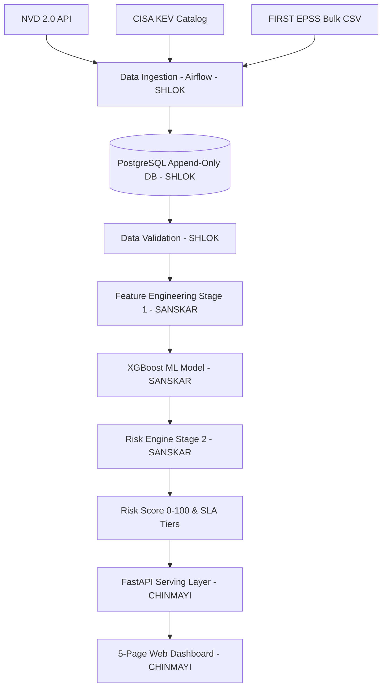
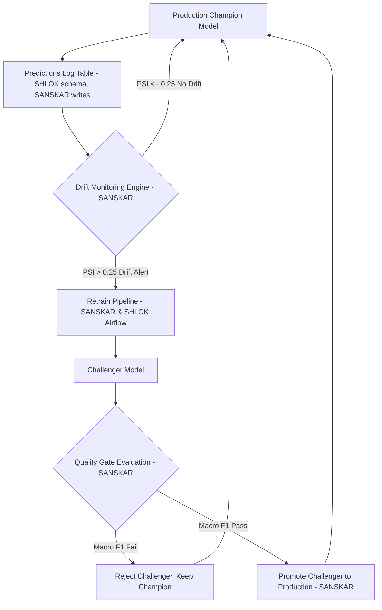

# Master Progress & Way Forward — Unified System Specification

> **Project Title:** Adaptive MLOps for Software Vulnerability Severity Classification & Risk Prioritization  
> **Workspace Root:** `MlopsCP-main`  
> **Consolidated From:** `SHLOK-data-and-infra.md`, `SANSKAR-ml-and-mlops.md`, `CHINMAYI-frontend-and-api.md`, and `implementationvuln.md`  
> **Document Purpose:** Single source of truth tracking completed work, active architecture, team contracts, and way-forward tasks across Data Infrastructure, ML/MLOps, and API/Frontend domains.  

---

## 1. Project Context & Consolidated Vision

Modern enterprise security teams face thousands of newly published Common Vulnerabilities and Exposures (CVEs) every month. Security analysts cannot patch every vulnerability immediately. Raw CVSS base scores alone do not reflect real-world threat context (e.g., whether an exploit is actively being used in the wild or whether the affected asset is internet-facing).

This platform combines **leakage-free machine learning severity prediction** with real-time threat intelligence (FIRST EPSS scores, CISA Known Exploited Vulnerabilities) and asset context to compute a dynamic **Composite Risk Score (0–100)** mapping to remediation SLA tiers.





---

## 2. Legacy Audit: Keep vs. Rebuild Matrix

| Component | Audit Decision | Rationale / Fix Applied |
|---|---|---|
| `nvd_client.py`, `epss_client.py`, `cisa_kev_client.py` | **Reused & Hardened** | Had pagination & rate limits; added gzipped bulk CSV decompression & catalog diffing. |
| `cvss_parser.py` | **Reused** | Structured extraction of 22 CVSS v3.1 binary metric flags. |
| `severity_classifier.py` (XGBoost) | **Reused & Calibrated** | Retargeted to Stage 1 leakage-free features; added Isotonic Calibration & SMOTE. |
| `explainer.py` (SHAP) | **Reused** | Provides SHAP TreeExplainer feature contribution waterfall outputs. |
| `docker-compose.yml`, `.github/workflows/ci_cd.yml` | **Reused & Extended** | Base infrastructure clean; updated service networking and integration tests. |
| Legacy `seed_data.py` (8 static templates) | **Replaced / Refactored** | Removed template repetition to prevent temporal split data leaks during training. |
| `airflow/dags/*` | **Rebuilt** | Fixed module imports and function signature mismatches (`fetch_cves_since`, `train_and_evaluate`). |
| `run_pipeline.py` | **Rebuilt** | Synchronized method calls across ingestion, validation, training, and scoring. |
| Risk Formula | **Standardized to ONE Formula** | Single 5-component additive weighted formula contract across code and docs. |
| Legacy Mock API Routes | **Rebuilding to Real DB** | Replacing static mock JSON returns with live PostgreSQL & MLflow database queries. |

---

## 3. Shared System Contracts

### 3.1 Database Schema (Shlok owns, all read/write against this)

```sql
CREATE TABLE cves (
    cve_id VARCHAR(20) PRIMARY KEY, published_date DATE NOT NULL, last_modified DATE,
    cvss_vector TEXT, cvss_score NUMERIC(3,1) CHECK (cvss_score BETWEEN 0 AND 10),
    cvss_severity VARCHAR(10), cwe VARCHAR(20), description TEXT,
    vendor VARCHAR(100), product VARCHAR(100), affected_versions TEXT
);
CREATE TABLE epss_history (        -- APPEND ONLY, never UPDATE
    id SERIAL PRIMARY KEY, cve_id VARCHAR(20) REFERENCES cves(cve_id),
    score NUMERIC(6,5) CHECK (score BETWEEN 0 AND 1), percentile NUMERIC(6,5),
    snapshot_date DATE NOT NULL, UNIQUE (cve_id, snapshot_date)
);
CREATE TABLE kev_history (         -- APPEND ONLY, never UPDATE
    id SERIAL PRIMARY KEY, cve_id VARCHAR(20) REFERENCES cves(cve_id),
    added_date DATE NOT NULL, first_seen_in_kev DATE NOT NULL
);
CREATE TABLE asset_inventory (
    asset_id SERIAL PRIMARY KEY, product VARCHAR(100), version VARCHAR(50),
    criticality INT CHECK (criticality BETWEEN 1 AND 5), internet_facing BOOLEAN
);
CREATE TABLE asset_cve_map (
    asset_id INT REFERENCES asset_inventory(asset_id), cve_id VARCHAR(20) REFERENCES cves(cve_id),
    PRIMARY KEY (asset_id, cve_id)
);
CREATE TABLE predictions_log (
    id SERIAL PRIMARY KEY, cve_id VARCHAR(20) REFERENCES cves(cve_id),
    model_version VARCHAR(50), predicted_at TIMESTAMP DEFAULT now(),
    prediction NUMERIC(6,5), features_snapshot JSONB
);
CREATE TABLE model_registry (
    model_version VARCHAR(50) PRIMARY KEY, trained_at TIMESTAMP, metrics_json JSONB,
    status VARCHAR(20) CHECK (status IN ('champion','challenger','retired'))
);
CREATE TABLE drift_reports (
    id SERIAL PRIMARY KEY, run_date DATE, feature VARCHAR(100), metric VARCHAR(20),
    value NUMERIC, threshold NUMERIC, flagged BOOLEAN
);
```

### 3.2 The ONE Risk Formula Contract

$$\text{RiskScore} = 100 \times \left[ 0.30 \cdot S_{\text{ML}} + 0.25 \cdot S_{\text{EPSS}} + 0.25 \cdot S_{\text{KEV}} + 0.15 \cdot S_{\text{Asset}} + 0.05 \cdot S_{\text{Exposure}} \right]$$

**Worked Example & Unit Test Standard:**  
For $S_{\text{ML}} = 0.72$, $S_{\text{EPSS}} = 0.55$, $S_{\text{KEV}} = 1.0$, $S_{\text{Asset}} = 0.8$, $S_{\text{Exposure}} = 1.0$:  
$$\text{Score} = (0.30 \cdot 0.72 + 0.25 \cdot 0.55 + 0.25 \cdot 1.0 + 0.15 \cdot 0.8 + 0.05 \cdot 1.0) \times 100 = 77.35 \implies \mathbf{HIGH\_RISK}$$

**Remediation SLA Priority Tiers:**
- **CRITICAL_RISK (80–100):** SLA 24–72 hours
- **HIGH_RISK (60–79):** SLA 7 days
- **MEDIUM_RISK (30–59):** SLA 30 days
- **LOW_RISK (0–29):** Best effort

---

## 4. Domain 1: Data Engineering & Infrastructure (Shlok Scope)

### A. Work Completed
1. **Database Schema Standardized (`docker/postgres/init.sql`):**
   - Implemented PostgreSQL schema containing append-only tables `epss_history` and `kev_history` to prevent historical data overwrites and eliminate temporal leakage.
   - Initialized tables: `cves`, `asset_inventory`, `asset_cve_map`, `predictions_log`, `model_registry`, and `drift_reports` with indexes and backwards-compatible view aliases.
2. **Ingestion Engine Hardened (`src/ingestion/`):**
   - `EPSSClient`: Implemented streaming bulk gzipped CSV decompression (`fetch_bulk_csv()`) for official daily FIRST EPSS releases.
   - `CISAKEVClient`: Hardened catalog retrieval (`fetch_catalog()`) and diffing logic.
   - `AssetMatcher`: Created enterprise asset inventory matching engine computing `asset_cve_map`.
   - `NVDClient`: Hardened rate limiting and incremental date range queries.
3. **Data Validation (`src/validation/schema_validator.py`):**
   - Implemented `DataValidator` / `VulnerabilitySchemaValidator` enforcing range constraints (`cvss_score` ∈ [0,10], `epss_score` ∈ [0,1]) and Pandera schema validation.
4. **Airflow Orchestration Rebuilt (`airflow/dags/`):**
   - Rebuilt `data_ingestion_dag.py`, `model_training_dag.py`, and `drift_monitoring_dag.py` to fix broken module imports and mismatched function signatures (`fetch_cves_since()`, `fetch_catalog()`, `train_and_evaluate()`, `promote_to_production()`).
5. **Pipeline Test Execution (`scripts/run_pipeline.py`):**
   - Verified clean execution across ingestion, validation, feature extraction, training, MLflow tracking, quality gate evaluation, and risk scoring.

### B. Way Forward (Shlok Tasks)
- [ ] **Historical Backfill Script (`scripts/backfill.py`):** Pull multi-year NVD dataset (2019–2026), FIRST historical EPSS archive (back to April 2021), and full KEV catalog into PostgreSQL to completely replace synthetic seed data.
- [ ] **Data Snapshot Versioning:** Integrate dataset hashing/snapshot tagging per training run in `src/mlops/versioning.py` linked to MLflow run IDs.
- [ ] **Docker Compose Verification:** Validate that all services (`postgres`, `airflow`, `mlflow`, `api`, `dashboard`) build and communicate seamlessly via `docker-compose up`.

---

## 5. Domain 2: ML Model, Risk Engine & Adaptive MLOps (Sanskar Scope)

### A. Work Completed
1. **Stage 1 Feature Extractor & CVSS Parser (`src/features/`):**
   - Built `CVSSVectorParser` parsing raw CVSS strings into 22 one-hot binary flags.
   - Built `FeatureEngineer` generating text keyword flags and CWE category groupings.
2. **Severity Classifier (`src/models/severity_classifier.py`):**
   - Implemented multi-class XGBoost softprob classifier with SMOTE oversampling and Isotonic Regression probability calibration.
3. **Explainability Engine (`src/models/explainer.py`):**
   - Built `VulnerabilityExplainer` generating SHAP waterfall contribution vectors for predictions.
4. **Experiment Tracking & Quality Gate (`src/training/`):**
   - Integrated MLflow experiment logging (`trainer.py`) and `ModelQualityGate` enforcing Macro F1, Critical Recall, and ECE thresholds.
5. **Statistical Drift Monitor (`src/monitoring/drift_detector.py`):**
   - Implemented `StatisticalDriftDetector` calculating Population Stability Index (PSI) and Kolmogorov-Smirnov (KS-test) p-values.
6. **Data Leakage Guard & Unit Verification (`tests/unit/test_leakage_guard.py`):**
   - Decoupled `STAGE1_FEATURES` from Stage 2 post-publication signals (`epss_score`, `in_cisa_kev`, `epss_percentile`) and created `test_leakage_guard.py`. Verified 100% pass rate across 16 total unit and integration tests.

### B. Way Forward (Sanskar Tasks)
- [ ] **Target Choice Documentation:** Document choice of Stage 1 target (CVSS Base Severity multi-class: NONE/LOW/MEDIUM/HIGH/CRITICAL) in README and compare metrics against trivial baseline.
- [x] **Leakage Guard Unit Test (`tests/unit/test_leakage_guard.py`):** Implemented test asserting `epss_score`, `epss_percentile`, `kev_flag`, `cvss_score`, and `cvss_severity` are **never** present in Stage 1 feature matrix `X`.
- [ ] **Risk Scorer Contract & Worked Example Test (`tests/test_risk_formula.py`):** Align `RiskScorer` weights to contract:
  $$\text{Score} = (0.30 \cdot S_{\text{ML}} + 0.25 \cdot S_{\text{EPSS}} + 0.25 \cdot S_{\text{KEV}} + 0.15 \cdot S_{\text{Asset}} + 0.05 \cdot S_{\text{Exposure}}) \times 100$$
  Assert worked example score equals **77.35** ($\pm 0.01$).
- [ ] **Champion-Challenger Promotion & Rollback (`src/mlops/promotion.py`):** Implement automated `promote_to_production()` and `rollback()` functions with unit tests in `tests/test_promotion_logic.py` covering both `promoted` and `rejected` cases.
- [ ] **Execute Experiments A & B:**
  - *Experiment A (Real Data Drift):* Execute drift monitoring on live ingested data and populate `drift_reports`.
  - *Experiment B (Synthetic Perturbation):* Perturb feature distributions in a test batch, verify drift detector fires alert.

---

## 6. Domain 3: API Serving & Executive Web Dashboard (Chinmayi Scope)

### A. Work Completed
1. **Core FastAPI Routes (`src/serving/api/`):**
   - Operational endpoints for `/predict`, `/risk-score`, `/explain`, and `/health` with Pydantic request/response schemas.
2. **Dashboard Prototype (`src/dashboard/`):**
   - HTML5/CSS3/JS executive dashboard layout with glassmorphism theme and Chart.js visualization widgets.

### B. Way Forward (Chinmayi Tasks)
- [ ] **Replace Mock Endpoints with Live DB/MLflow Queries:**
  - `GET /vulnerabilities`: Server-side paginated query joining `cves`, latest `epss_history`, `kev_history`, and calculated risk scores. Must support `limit`, `sort`, `kev_only`, and `min_cvss` query parameters.
  - `GET /models`: Query `model_registry` and MLflow for active champion model version, training metrics, and run history.
  - `GET /drift`: Query `drift_reports` table for latest PSI/KS metrics.
  - `GET/POST/PUT /assets`: Asset inventory management triggering `AssetMatcher` recomputation.
  - `GET /remediation`: Fetch vulnerabilities affecting mapped assets in `asset_cve_map` sorted by `risk_score` descending.
  - `POST /retrain`: Trigger Airflow retraining DAG / job.
- [ ] **API Route Unit Tests (`tests/test_api_routes.py`):** Assert that responses dynamically change when underlying database state changes (verifying endpoints are not returning hardcoded JSON).
- [ ] **Build 5-Page Web Dashboard:**
  1. **Explorer (`/explorer`):** Server-side paginated CVE table with filters and SHAP explanation modal.
  2. **Remediation (`/remediation`):** Asset-mapped vulnerabilities table with SLA badges and summary cards.
  3. **Assets (`/assets`):** Asset inventory CRUD form with live recomputation triggering.
  4. **Monitoring (`/monitoring`):** Model performance metrics card, drift status panel, model registry history, and retrain trigger button.
  5. **CVE Detail / Timeline (`/cve/{id}`):** EPSS trend line chart over time with KEV entry markers.

---

## 7. Master Progress Matrix & Phase Status

| Phase | Phase Description | Status | Primary Owner | Deliverables / Missing Elements |
|---|---|---|---|---|
| **Phase 0** | System Specification & Audit | **COMPLETED** | All | `sanskarv1.txt` audit complete; contracts locked. |
| **Phase 1** | ML Target Lock | **COMPLETED** | Sanskar | Severity multi-class locked; baseline comparison pending. |
| **Phase 2** | DB Schema & Ingestion | **IN PROGRESS** | Shlok | Schema & clients done; `backfill.py` historical pull pending. |
| **Phase 3** | Leakage-Free Feature Engine | **IN PROGRESS** | Sanskar | Feature extractor built; `test_leakage_guard.py` pending. |
| **Phase 4** | Stage 1 XGBoost Training | **COMPLETED** | Sanskar | SMOTE + Isotonic XGBoost + MLflow tracking operational. |
| **Phase 5** | Risk Engine (Stage 2) | **IN PROGRESS** | Sanskar | `RiskScorer` operational; 77.35 unit test pending. |
| **Phase 6** | Serving API & Dashboard | **IN PROGRESS** | Chinmayi | Core API operational; mock endpoint replacement & 5-page frontend pending. |
| **Phase 7** | Airflow Orchestration | **COMPLETED** | Shlok | 3 DAGs rebuilt and synchronized with real code. |
| **Phase 8** | Statistical Drift Monitor | **COMPLETED** | Sanskar | `StatisticalDriftDetector` (PSI/KS) active and tested. |
| **Phase 9** | Retrain / Promote / Rollback | **IN PROGRESS** | Sanskar | Quality gate done; promotion/rollback module pending. |
| **Phase 10**| Experiments A & B | **PENDING** | Sanskar | Real drift run & synthetic perturbation test pending. |
| **Phase 11**| Final System Integration | **PENDING** | All | Full E2E CI/CD execution and demo validation. |

---

## 8. Definition of Done & Unified Acceptance Checklist

- [ ] **Data & Infrastructure:** Real multi-year dataset in PostgreSQL (`epss_history`/`kev_history` append-only verified); 3 Airflow DAGs executing without errors; `docker-compose up` bringing up all services.
- [ ] **ML & MLOps:** `test_leakage_guard.py` passing zero-leakage assertions; `test_risk_formula.py` passing exact 77.35 worked example; `promotion.py` tested for both promotion and rejection; Experiments A and B executed with documented results.
- [ ] **API & Frontend:** All FastAPI routes returning dynamic DB/MLflow data (zero mock endpoints); `test_api_routes.py` verifying dynamic response updates; 5-page dashboard fully functional with server-side pagination and SHAP waterfall visuals.
- [ ] **System Verification:** `scripts/run_pipeline.py` and CI workflow passing end-to-end without warnings or failures.
